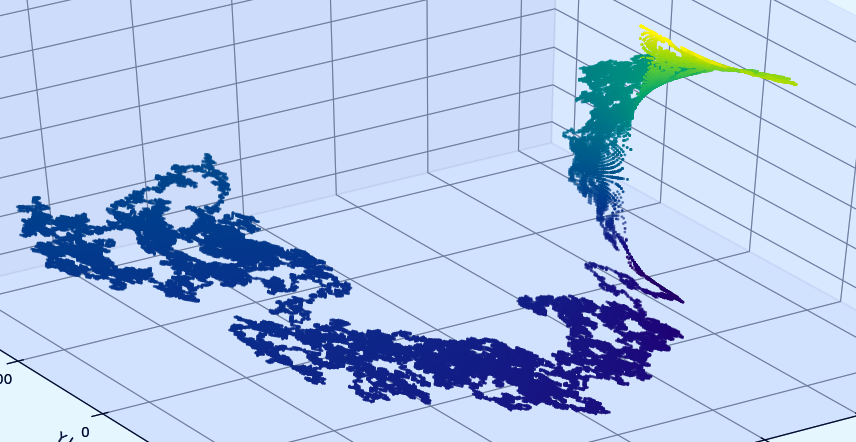
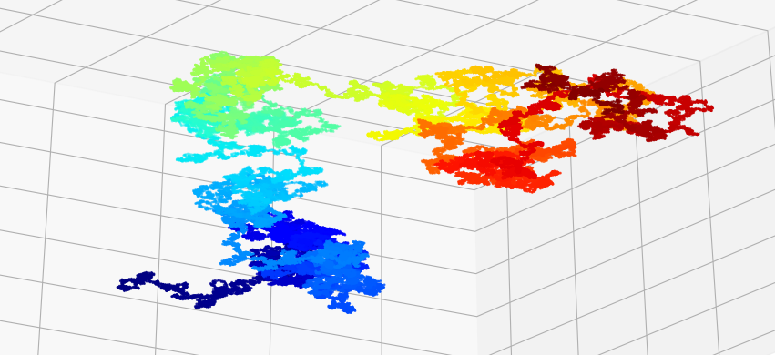

# RANDOM WALK

A command line utility written in python for creating visualizations of \
random walks in Python 3 with numpy and matplotlib.

## Usage
python3 main.py -h  
Usage:  
-t --type | Type of output, an animation or a plot, defaults to plot  
-s --size | Array size, defaults to 10000  
-d --dimensions | Accepts 2 or 3 dimensions, defaults to 2  
-p --plot_output | File to output the plot/animation to, defaults to none, overwrites file if it already exists  
-o --output | File to output the random walk data to, defaults to none, overwrites file if it already exists  
  

## Samples

This software is provided under the MIT License, see LICENSE for more details. 
